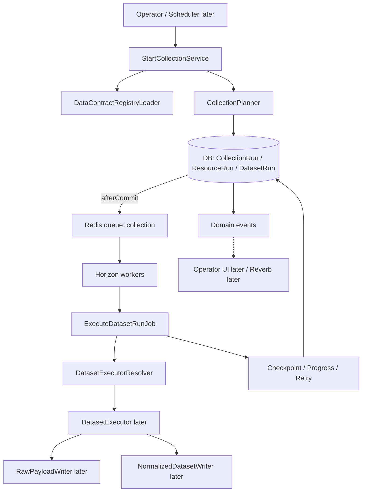

# Collection Engine Architecture (Prompt 9)

Status: **REAL** (shared control plane). Provider-specific collectors: **NOT implemented by this prompt**.

## 1. Purpose

Shared production ingestion control plane for all future provider/source collectors.

```text
Frozen Product
        ↓
Data Contract Registry V1
        ↓
Collection Planner
        ↓
CollectionRun
        ↓
ResourceRun(s)
        ↓
DatasetRun(s)
        ↓
Redis Queue (+ Horizon workers)
        ↓
Provider-neutral DatasetExecutor boundary
        ↓
Raw / Normalized Writer boundary (Prompt 10)
        ↓
Persistent Progress / Retry / Checkpoint
        ↓
Database Canonical State
```

Hard rule: **the browser is not the collection engine**. Database owns durable state. Redis/Horizon execute work. WebSockets may notify later; they are never canonical.

## 2. Run model decision (OPTION B)

| Concept | Decision |
| --- | --- |
| Existing `Run` | **KEEP** — Evidence parent, Activity Center, diagnosis/discovery/SEO/AI, legacy `CollectLiveBoundDataJob` |
| New `CollectionRun` hierarchy | **CANONICAL** for contract-driven collection control plane |
| Long-term | One collection control plane (`CollectionRun`). Legacy bound-collect→`Run` orchestration is **DEPRECATED LATER** once providers migrate (Prompt 13+) |

There are not two long-term *canonical* collection-run concepts: new contract-driven collection uses `CollectionRun`; existing `Run` remains the universal Activity/Evidence spine.

## 3. Domain hierarchy

| Entity | Table | Meaning |
| --- | --- | --- |
| CollectionRun | `collection_runs` | One operator/system collection operation |
| ResourceRun | `collection_resource_runs` | One bound resource / enrichment target |
| DatasetRun | `collection_dataset_runs` | One registry dataset/request-family execution |
| Attempt | `collection_dataset_attempts` | Durable attempt history (not Horizon duplicate) |

Chunk identity uses DatasetRun checkpoint + queue job continuation (`CONTINUE` outcome). No DB mirror of every Horizon statistic.

## 4. Architecture diagram



## 5. Lifecycle states

`queued` → `running` → (`retrying` | `completed` | `failed` | `partial` | `cancellation_requested` → `cancelled`)

Also: `skipped`, `not_eligible`.

**Terminal (aggregate):** `completed`, `failed`, `partial`, `cancelled`, `skipped`, `not_eligible`.

**Resume exception:** `failed` → `queued` (same DatasetRun, explicit resume only). Completed runs are never mutated into replays.

### Transition table (summary)

| FROM | EVENT | TO | RETRYABLE? | TERMINAL? |
| --- | --- | --- | --- | --- |
| queued | worker start | running | — | no |
| queued | cancel | cancelled | no | yes |
| queued | unimplemented/required fail | failed | no | yes |
| running | success | completed | — | yes |
| running | transient | retrying | yes | no |
| running | terminal error | failed | no | yes |
| running | cancel request | cancellation_requested | no | no |
| retrying | backoff elapsed | running/queued | — | no |
| failed | explicit resume | queued | — | no |
| cancellation_requested | children done | cancelled/partial | no | yes |

## 6. Aggregation

- Required dataset terminal failure + sibling success → parent **PARTIAL**
- All required failed → **FAILED**
- Optional failure alone → parent may still **COMPLETED**
- `not_eligible` ≠ failure
- Sibling datasets are isolated (one failure does not stop others)

## 7. Progress

Modes: `counted`, `stage_based`, `indeterminate`, `page_based`, `chunk_based`.

- Counted: percentage only when total > 0
- Indeterminate/page/chunk: **never fabricate %**
- Aggregate progress: datasets/resources completed counts — **no magic weighted score**

## 8. Retry / resume / cancel

- `DefaultRetryPolicy` — timeout/network/5xx/rate_limit retryable; auth/quota/invalid/unimplemented not
- No blocking sleeps — queue delay / `retry_at`
- Checkpoint advances only after safe persistence boundary (invariant); secrets forbidden
- Resume = same DatasetRun + checkpoint; Replay = new CollectionRun
- Cancellation cooperative; queued children cancel immediately; no auto-retry after cancel

## 9. Queue / Redis / Horizon

| Concern | Choice |
| --- | --- |
| App default queue | may remain `database` (Activity Center) |
| Collection queue connection | `COLLECTION_QUEUE_CONNECTION=redis` |
| Collection queue name | `collection` |
| Horizon | installed — **infrastructure dashboard only**, not product UI |
| Sync driver | rejected for collection start |

Local/Cloud without Redis: set `COLLECTION_QUEUE_CONNECTION=database` for background jobs; tests use `Queue::fake()`.

## 10. Contract relationship

- Planner reads `MOXDOP_DATA_CONTRACT_REGISTRY_V1.json`
- Every DatasetRun stores `contract_registry_version`, dataset id, request family id
- CollectionRun stores registry id/version/checksum + plan snapshot
- Collectors do **not** invent requirements

## 11. Storage boundary (Prompt 10)

Interfaces only:

- `RawPayloadWriter` (null impl)
- `NormalizedDatasetWriter` (null impl)

No provider fact tables. No BigQuery. No object storage required for tests.

## 12. Collection ≠ Evidence

Collection completion does **not** create Evidence.

Legacy `CollectLiveBoundDataService` still writes Evidence via existing collectors — **KEEP** until provider migration. Boundary documented; Prompt 38 will canonicalize Evidence later.

## 13. Existing architecture reuse

| Component | Disposition | Why |
| --- | --- | --- |
| `Run` | KEEP | Evidence/Activity/non-collection ops |
| `Evidence` | UNCHANGED | Not redesigned here |
| `BoundCollectorRegistry` | KEEP | Legacy bound collectors |
| `DiscoversProviderResources` | KEEP | Discovery unchanged |
| `CollectsBoundProviderData` | KEEP / ADAPT later | Future DatasetExecutor adapters |
| `CollectLiveBoundDataService` | KEEP / DEPRECATED LATER for orchestration | Still powers Activity Center collect |
| Existing provider collectors | UNCHANGED | No Prompt 9 productionization |
| Async jobs / Activity Center | KEEP | Parallel path until migration |

## 14. Error categories

`authentication`, `authorization`, `rate_limit`, `quota`, `timeout`, `network`, `provider_5xx`, `invalid_request`, `contract_mismatch`, `unimplemented_capability`, `normalization`, `persistence`, `cancelled`, `unknown`.

Persisted messages are sanitized (no tokens/secrets).

## 15. Security

- Queue payload: DatasetRun ID only
- No credentials in checkpoint / run metadata / logs
- Horizon gated to Admin role
- Authorization for start must reuse existing asset/binding policies when UI wires Prompt 11

## 16. Provider collectors implemented by Prompt 9

**NONE.**
